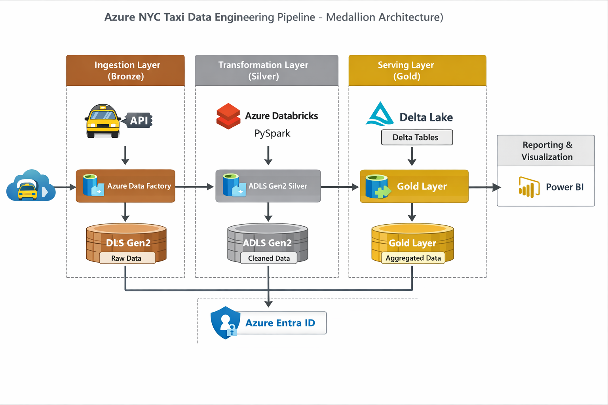

# 🚕 Azure NYC Taxi: End-to-End Medallion Pipeline

## 📌 Project Overview
This repository contains a production-grade data engineering pipeline built on **Microsoft Azure**. The project automates the ingestion, transformation, and serving of NYC Green Taxi records. 

By implementing the **Medallion Architecture (Bronze -> Silver -> Gold)**, I transformed raw, inconsistently formatted API data into high-performance Delta tables ready for analytical reporting and BI.

---

## 🏗️ Architecture & Data Flow


### 1. Ingestion Layer (Bronze)
* **Tool:** Azure Data Factory (ADF)
* **Strategy:** Developed a **fully dynamic ingestion engine**.
* **The Logic:** Instead of hardcoding 12 different pipelines, I used a `ForEach` activity with an `If Condition`. This automatically handles the NYC Taxi API's naming convention (adding a leading zero for months 1-9 vs. no zero for months 10-12).
* **Storage:** Data is landed in **Azure Data Lake Storage (ADLS) Gen2** in Parquet format with Snappy compression for optimal storage costs.

### 2. Transformation Layer (Silver)
* **Tool:** Azure Databricks (**PySpark**)
* **Data Engineering Best Practices:** * **Schema Enforcement:** I manually defined the `StructType` schema for trip data rather than relying on `inferSchema`, ensuring data types remain consistent and performant.
    * **Complex Transformations:** Performed string manipulation (splitting `Zone` attributes), date/time extraction (`year`, `month`, `day`), and column pruning to reduce the data footprint.
    * **Format:** Data is converted from raw Parquet/CSV into a refined Parquet format in the Silver container.

### 3. Serving Layer (Gold)
* **Tool:** Spark SQL & **Delta Lake**
* **The "Gold" Standard:** Processed data is stored as **Delta Tables** within a dedicated `gold` database.
* **Delta Lake Features Demonstrated:**
    * **ACID Transactions:** Performed `UPDATE` and `DELETE` operations on big data sets.
    * **Time Travel:** Leveraged `DESCRIBE HISTORY` and `RESTORE` commands to audit changes and roll back data to specific versions.
    * **External Tables:** Used external tables to decouple the compute (Databricks) from the storage (ADLS Gen2), preventing accidental data loss.

---

## 📂 Repository Structure
```text
├── ADF/
│   ├── Pipelines/          # Dynamic ingestion logic (JSON)
│   ├── Datasets/           # Source API and Sink ADLS definitions
│   └── Linked_services/    # Connection logic for Web & Storage
├── Databricks_Notebooks/
│   ├── 01_silver_transformation.py  # PySpark cleaning & Schema logic
│   └── 02_gold_delta_processing.py  # Delta Lake & SQL serving logic
├── Architecture_Diagram/   # Pipeline visualization
├── Data/                   # Static lookup files (Zones, Trip Types)
└── README.md
